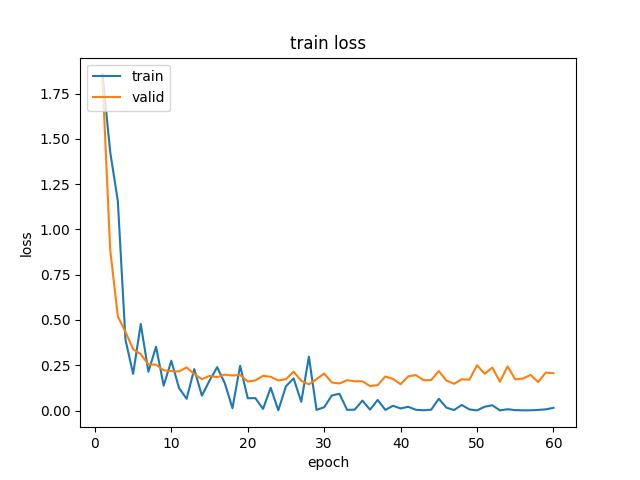
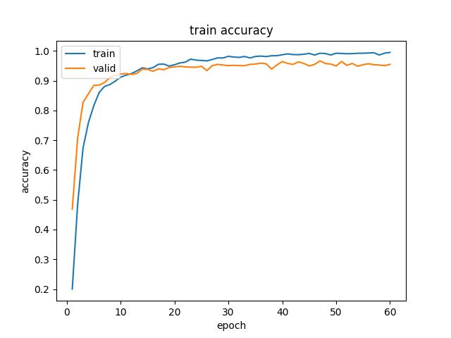
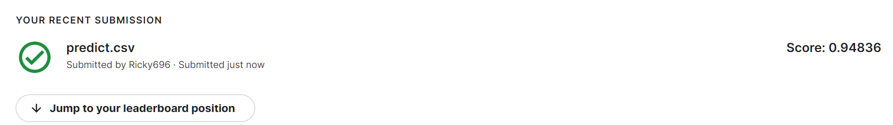

# Plant Seedlings Classification

###[Competition In Kaggle](https://www.kaggle.com/c/plant-seedlings-classification)

## File Introduction
 + `Load_data.py` -> Data preprocessing & Define Dataset

+ `Train.py` -> Train model

+ `predict.py` -> Predict test data & create .csv file

+ `model (trained model & model structure) : `
```python
    model structure():
        #model_vgg16.py
        #simpleNet.py
        #vgg16_pre_trained.py
    trained model():
        #simpleNet.pt
        #VGG16.pt
```

> Because VGG16.pt is too large, so download in [HERE](https://drive.google.com/file/d/1wpC13TOo5J3TwrPUdjHY8mX01jjXWEWM/view?usp=sharing)

## Loss & Accuracy
Last I used VGG16's Pretrained model, and random rotate picture to slove this classification problem


